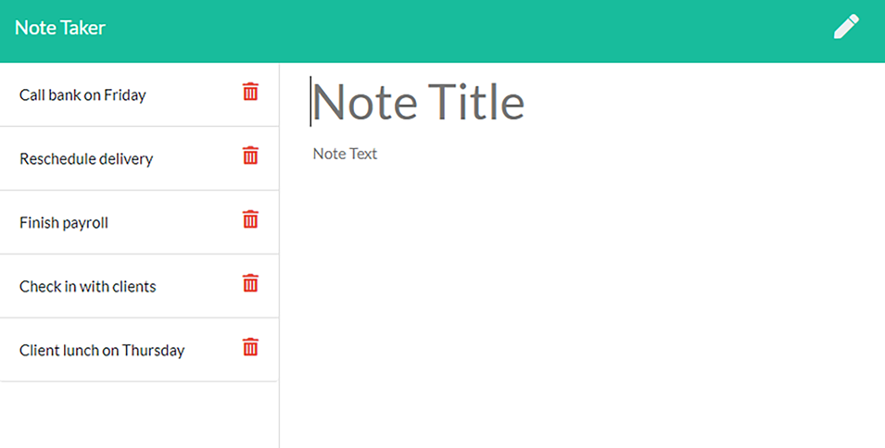

# Note-taker

## Description 

Easily take and save notes!

## Table of Contents

* [Usage](#usage)
* [Mockup](#mockup)
* [License](#license)
* [Questions](#questions)

## Usage 

Go to https://morning-sierra-26337.herokuapp.com/notes. Click get started, then type something into bothe the Title section and text section. After both are populated, click the save icon to add it to the list on the left. You can click any title on the left list to display the selected note. Click the pencil icon to enter a new note. Functions are in place to delete notes but it doesn't currently work.

## Mockup

## License

MIT

## Questions?
Github: [beatypete](https://github.com/beatypete)
Feel free to email me with any questions at akira941@gmail.com
    